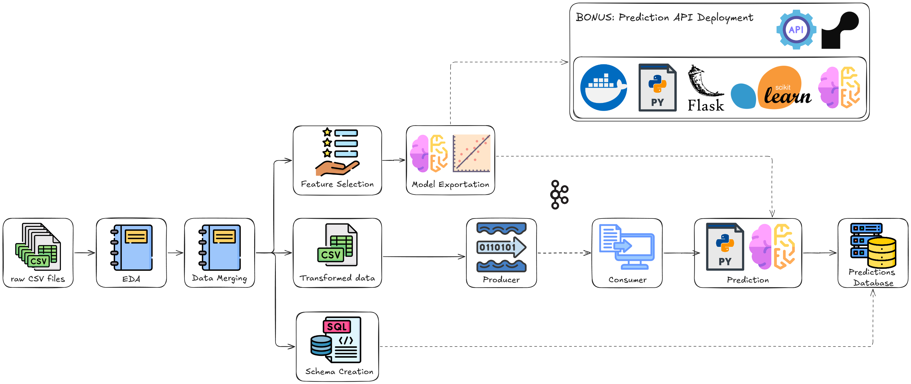

<p align="center"></a></p>

## 📋 Overview  
This project builds an end-to-end pipeline for predicting happiness scores of countries using machine learning and real-time data streaming. It incorporates:
- 📊 **Exploratory Data Analysis (EDA)** for insights and transformations.
- 🧠 **Machine Learning** regression to predict happiness scores.
- 🚀 **Kafka-based streaming** for real-time processing.
- 🗄️ **Database integration** for storing predictions.
- 🛠️ **API for on-demand predictions** hosted on a scalable platform.

The pipeline is modular and automated, enabling seamless updates and experimentation with models.

---

## 🛠️ Tools and Technologies  
| **Technology**         | **Purpose**                                                                 |
|-------------------------|-----------------------------------------------------------------------------|
|         | Development and scripting                                              |
|         | Containerization of services                                           |
|  | Real-time data streaming                                              |
| | Workflow orchestration and pipeline automation                        |
| | Database for storing predictions                                       |
| | Machine learning model development                                     |
|        | Data visualization                                                     |
|         | Advanced visualizations                                                |
|        | Model serialization                                                    |
|         | Dependency management and packaging                                    |

---

## 🏗️ Project Nodes  



### 1. 📂**Data Preprocessing**  
    - Receive the 5 csv
    - Performs data merging
    - Performs an EDA
    - Upload data by rendering schema and data seed queries

### 2. 🔍 **EDA**  
    -  Analyzing variables such as GDP, Social Support, and Happiness Score.  
    - 📈 Visualizing trends and correlations.  

### 3. **Model Training**  

   - 🎯 Training a regression model using a 70-30 split.  
   - 📊 Evaluating performance using R² and other metrics.  

### 4. **Data Streaming**  
   - 🌀 Kafka producer streams transformed data in real time.  
   - ⚙️ Kafka consumer processes streamed data for predictions.  

### 5. **API**  
   - 🌐 Hosted API for predicting happiness scores.  
   - 🔁 Automated redeployment via GitHub commits.  

### 6. **Database Management**  
   - 🗄️ PostgreSQL stores input features and predictions.  

### 7. **Pipeline Automation**  
   - 🤖 Airflow orchestrates the ETL and automates model updates.  

---

## 📂 Repository Contents  
```plaintext
api/
├── ... # All the Happiness Prediction API. 
│   ├── context/
│   │   ├── Workshop 3 Machine learning and Data streaming.pdf # Rubric of the project
│   ├── dags/
│   │   ├── ...  # All the files for Airflow Pipeline
│   ├── docs/
│   │   ├── api /
│   │   |   ├── Happiness Prediction API - Methods.postman_collection.json # API methods
│   │   ├── ...  # Copy of the documentation
│   ├── kafka/
│   │   ├── consumer / # Kafka config for the consumer container
│   │   ├── producer / # Kafka config for the producer container
│   ├── models/
│   │   ├── 00_happiness_score_prediction_model.pkl # Base model 
│   ├── notebooks/
│   │   ├── ... # Notebooks for all the proyect steps
│   ├── sql/
│   │   ├── queries /
│   │   ├── api /
│   ├── sql/
│   │   ├── connections /
│   │   ├── utils /
├── Dockerfile            # Docker configuration for containerizing the Airflow
├── docker-compose.yml    # docker-compose configuration
├── pyproject.yml         # Poetry Config
├── README.md                    # Documentation (you're reading it now!)
```

---

## 🚀 How to Run the Project  

### 1️⃣ Clone the Repository  
```bash
git clone https://github.com/DCajiao/workshop003_Machine_learning_and_Data_streaming.git
cd workshop003_Machine_learning_and_Data_streaming
```

### 2️⃣ Configure Environment Variables  
Create a `.env` file in `src/` and add the following:  
```plaintext
DBNAME=...
DBUSER=...
DBPASS=...
DBHOST=...
DBPORT=5432
```

### 3️⃣ Start the Services  
Run the following commands:  
```bash
docker-compose up airflow-init
docker-compose up -d
```

### 4️⃣ Access Airflow  to run the training pipeline
- Go to `http://localhost:8080`.  
- Log in with:
  - **Username**: `airflow`  
  - **Password**: `airflow`  
- Activate and trigger the DAG to execute the pipeline.  

### 5️⃣ Access to consumer and producer container logs
- Watch in real time how data is sent from the *producer*
- Watch in real time how the *consumer* makes the request to the prediction API and inserts the features with the prediction into the database within the `predicted_data` table.

---
If you want to learn more about how this project works, you can find a more detailed analysis at [the final report](./docs/report/)


### 🌟 Enjoy exploring the automated happiness prediction pipeline! 😊  
